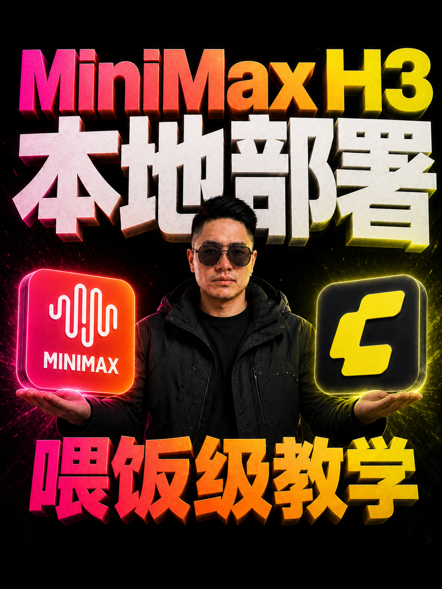

# Feige Cover Design Skill

非哥结合自己长期封面创作、抽卡、返工和多比例适配经验，持续改造出来的一套中文封面 Agent Skill：先确认标题，再做平台语义路由，生成 6 个不同的视觉事件；母版确认后，可靠适配多平台比例，并为 `5:1` 超宽横幅提供独立保真分支。

[](./SKILL.md)
[](https://github.com/s840207702)
[](https://github.com/pyang5166/gbro-cover-design)
[](./references/ratio-native-recomposition.md)
[](./references/quality-review.md)
[](./LICENSE)

## 项目来源与非哥版改造

本项目基于 [pyang5166/gbro-cover-design](https://github.com/pyang5166/gbro-cover-design) 的 MIT 开源工作继续创作；该项目本身又基于 [feitangyuan/oh-my-cover-design](https://github.com/feitangyuan/oh-my-cover-design) 演进。

上游提供了“从文章内容生成真人封面提示词、以 3:4 为默认竖版、使用人物与产品参考图”的重要起点。非哥在自己的长期实际生产中，没有只做换皮或增加几条提示词，而是重新设计了主要工作流：

| 上游起点 | Feige 版本的结合与优化 |
| --- | --- |
| 固定 3:4、三轮提问、10 种风格模板 | 标题确认后自动做语义路由，默认生成 6 个内容专属视觉事件，不要求用户先懂风格分类 |
| 人脸图 + 额外产品素材 | 人物参考只锁身份；平台图标按标题自动核验和准备，头像型图标不会被放大成第二张巨脸 |
| 输出一份生图提示词 | 输出 6 份真正不同的完整提示词，由用户抽卡并确认满意母版 |
| 只负责 3:4 提示词 | 母版确认后适配 `4:3 / 1:1 / 5:2 / 16:9 / 2.35:1 / 5:1`，并生成公众号组合图 |
| 提醒检查中文 | 建立硬文字清单，逐比例原尺寸 Review，只重做错字、留白或构图失败的比例 |
| 没有极限横幅专用路线 | 为精确 `2000×400` 的 `5:1` 增加空背景补全与原像素主体重排，避免整图压扁或重绘 |

完整的上游版权与差异说明见 [NOTICE.md](./NOTICE.md)。

## 真实 3:4 封面案例

这些成品展示的不是四套固定模板，而是同一套工作流如何围绕不同标题，重新设计人物动作、核心物、标题身份和品牌色。

<table>
  <tr>
    <td width="50%" valign="top">
      
      <br><strong>MiniMax H3 本地部署</strong>
      <br><sub>人物托举两个产品核心，品牌色从左右向中心汇合；大标题、真人与双产品关系在缩略图中仍能同时读清。</sub>
    </td>
    <td width="50%" valign="top">
      
      <br><strong>WorkBuddy 新手入门教学</strong>
      <br><sub>把应用图标实体化为巨大工具核心，人物的托举与指向共同解释“入门”，没有退回普通人物站桩。</sub>
    </td>
  </tr>
  <tr>
    <td width="50%" valign="top">
      
      <br><strong>WorkBuddy 7 个神仙办公 Skill</strong>
      <br><sub>用七层办公能力抽屉承载数字与功能关系，人物正在拉出结果层，核心视觉事件只属于这个标题。</sub>
    </td>
    <td width="50%" valign="top">
      
      <br><strong>OpenSquilla 搭建 AI 选题雷达</strong>
      <br><sub>品牌核心被改造成近距离雷达装置，人物同时操作与交付结果，黑橙材质统一标题、动作和产品事实。</sub>
    </td>
  </tr>
</table>

以上图片由作者明确授权在本仓库中公开展示。案例图片、人物肖像和第三方商标不随根目录 MIT License 开放再利用，详见 [案例素材许可边界](./examples/LICENSE.md)。

## 它解决什么问题

普通“改尺寸”提示词经常出现两种失败：

- 普通比例被过度重构，原本成熟的标题、人物和 Logo 关系被拆散；
- 超宽比例被直接重绘或压扁，造成人物、文字、色彩和构图失真。

本 Skill 把两类任务分开：

- `3:4 / 4:3 / 1:1 / 5:2 / 16:9 / 2.35:1` 默认保持原构图，只做必要微调；
- 精确 `2000×400` 的 `5:1` 才释放结构重组权限，并优先复用满意母版原像素前景。

每张结果都经过硬文字、空间利用、人物、手部、Logo、尺寸和色彩 Review；只重做失败比例。

## 非哥版四阶段工作流

### 一、先确认封面标题

- 已经想好标题：直接锁定原文，不擅自改写。
- 没想好标题：把 Obsidian 里的脚本、正文或内容直接发给 Agent，它会提炼 5 个短标题并给出主推。
- 标题未确认前，不提前写完整画面提示词。

### 二、根据标题做平台语义路由

标题确认后，Agent 判断本期涉及几个明确平台、产品或模型，以及它们是并列、对比还是流程关系。

例如“MiniMax H3 本地部署教学”同时明确涉及 ComfyUI 与 MiniMax，可以开放双平台图标关系；普通单产品教程则以一个准确图标和一个内容核心物为重点，不为凑数量堆 Logo。

### 三、生成六套提示词并抽出满意母版

- 默认输出 6 套不同造型与视觉事件的完整提示词。
- 同步准备标题真正需要的官方平台图标：本地已有核验文件就复用，没有时再从官方来源获取。
- 用户准备一张清晰正面人物照片，只承担身份参考，不继承自拍姿势、衣服、背景和光线。
- 非哥当前个人工作流优先把提示词、人物图和平台图标交给 ChatGPT 网页端的 ChatGPT Images 2.0 抽卡。这是多轮实测后的默认选择；公开 Skill 仍兼容其他支持参考图的图像模型。
- 只有用户明确确认满意、采用或定稿的图片，才成为后续尺寸适配的唯一母版。

### 四、一张满意母版适配完整尺寸包

默认从 `3:4` 母版生成 `4:3`、`1:1`、`5:2`、`16:9`、`2.35:1` 和 `5:1`：

- 普通比例保持原构图和元素组合，只做必要的等比缩放、轻微位移、间距与背景延展。
- `5:2` 可用于工具箱网站滚屏海报，也适合 X 文章封面。
- `1:1` 与 `2.35:1` 通过 Review 后，生成公众号文章专用的左侧方图 + 右侧宽图组合图。
- `5:1` 用于飞书云文档等超宽背景，固定为 `2000×400`；先生成空背景，再解构并重排母版中的标题、人物、Logo 和核心物，禁止整图压扁、整图重绘和全局追色。
- 每个结果都按原尺寸检查错字、空间利用、人物、手部、Logo、构图、尺寸和色彩，只重做失败比例。

## 仓库提供什么

| 能力 | 仓库内置 | 由宿主 Agent 或图像工具完成 |
| --- | --- | --- |
| 标题确认与视觉语义路由 | 是 | Agent 执行 |
| 六套提示词的差异门禁 | 是 | Agent 执行 |
| 普通比例与 5:1 策略 | 是 | Agent 读取规则并调用图像工具 |
| 图像生成与编辑模型 | 否 | 需要宿主具备图像生成或编辑能力 |
| 官方 Logo 获取 | 规则内置 | 需要联网能力或用户提供文件 |
| 确定性 PNG 分层合成 | 是 | Python + Pillow |
| 公众号组合图 | 是 | Python + Pillow |
| 人物身份素材 | 否 | 仅使用用户在当前任务主动提供的附件 |

这不是一个独立的在线生图服务。若宿主 Agent 没有图像生成能力，它仍会交付可复制的提示词和完整 Review 标准，用户可在自己选择的图像工具中完成生成。

## 快速开始

### 1. 克隆到独立目录

```bash
mkdir -p "$HOME/.local/share/agent-skills"
git clone https://github.com/s840207702/feige-cover-design-skill.git \
  "$HOME/.local/share/agent-skills/feige-cover-design-skill"
python3 -m pip install -r \
  "$HOME/.local/share/agent-skills/feige-cover-design-skill/requirements.txt"
```

### 2. 安装为项目 Skill

进入实际要使用本 Skill 的项目，再创建链接。不要在 `feige-cover-design-skill` 仓库内部执行下面的命令。

Codex 项目（把第一行替换成你的项目绝对路径）：

```bash
cd /absolute/path/to/your-codex-project
mkdir -p .agents/skills
ln -s "$HOME/.local/share/agent-skills/feige-cover-design-skill" \
  .agents/skills/feige-cover-design
```

Claude Code 项目（把第一行替换成你的项目绝对路径）：

```bash
cd /absolute/path/to/your-claude-project
mkdir -p .claude/skills
ln -s "$HOME/.local/share/agent-skills/feige-cover-design-skill" \
  .claude/skills/feige-cover-design
```

如果不希望使用软链接，也可以把整个仓库复制到目标项目对应的 Skill 目录。安装完成后重新启动或刷新宿主 Agent，再通过 `$feige-cover-design` 调用。

### 3. 直接调用

从主题开始：

```text
使用 $feige-cover-design，为“本地部署大模型的新手教程”设计封面。先帮我确认标题。
```

标题已确认：

```text
使用 $feige-cover-design。标题固定为“本地部署大模型”，输出 6 套真正不同的封面提示词。
```

母版已确认：

```text
使用 $feige-cover-design，把这张满意母版生成完整尺寸包，包括 5:1 和公众号组合图。
```

## 默认输出

- 母版：默认 `3:4`
- 完整尺寸包：`3:4`、`4:3`、`1:1`、`5:2`、`16:9`、`2.35:1`、`5:1`
- `5:1`：精确 `2000×400`
- 公众号组合图：通过 Review 的 `1:1 + 2.35:1`

## 本地脚本

```bash
python3 scripts/render-ratio-pack.py --self-test
python3 scripts/build-wechat-cover-stitch.py --help
python3 scripts/audit_public.py
python3 -m unittest discover -s tests
```

`render-ratio-pack.py` 只用于需要原像素图层重排的确定性任务，尤其是 `5:1`；普通比例首轮不需要预先抠图。

## 隐私与品牌边界

- 除 `examples/approved-covers/` 中明确授权公开展示的成品外，仓库不包含人物原始参考照片、私有案例、历史输出或本机素材目录。
- 人物身份参考只应在当前任务中由用户主动提供，不应被默认归档或提交到 Git。
- 产品名、Logo 和商标归各自权利方所有，只应从官方来源取得并按其规则使用。
- 未经明确授权，不要把客户案例、人物肖像或生成成品提交到公共 `examples/`。
- 示例目录适用单独的 [案例素材说明](./examples/LICENSE.md)。

更多安全边界见 [SECURITY.md](./SECURITY.md)。

## 项目结构

```text
.
├── SKILL.md
├── agents/openai.yaml
├── references/
├── scripts/
├── tests/
├── examples/
├── licenses/
├── CONTRIBUTING.md
├── SECURITY.md
├── NOTICE.md
└── LICENSE
```

## 贡献

欢迎提交跨平台脚本、比例适配测试、公开授权案例和 Review 改进。请先阅读 [CONTRIBUTING.md](./CONTRIBUTING.md)。

## 许可证

Skill 文本和代码采用 [MIT License](./LICENSE)。[gbro-cover-design](https://github.com/pyang5166/gbro-cover-design) 的完整 MIT 版权文本保存在 [licenses/gbro-cover-design-LICENSE](./licenses/gbro-cover-design-LICENSE)，其中同时保留了 `oh-my-cover-design` 的上游声明。案例图片、人物肖像、商标和第三方素材不因根目录 MIT License 自动获得授权。
